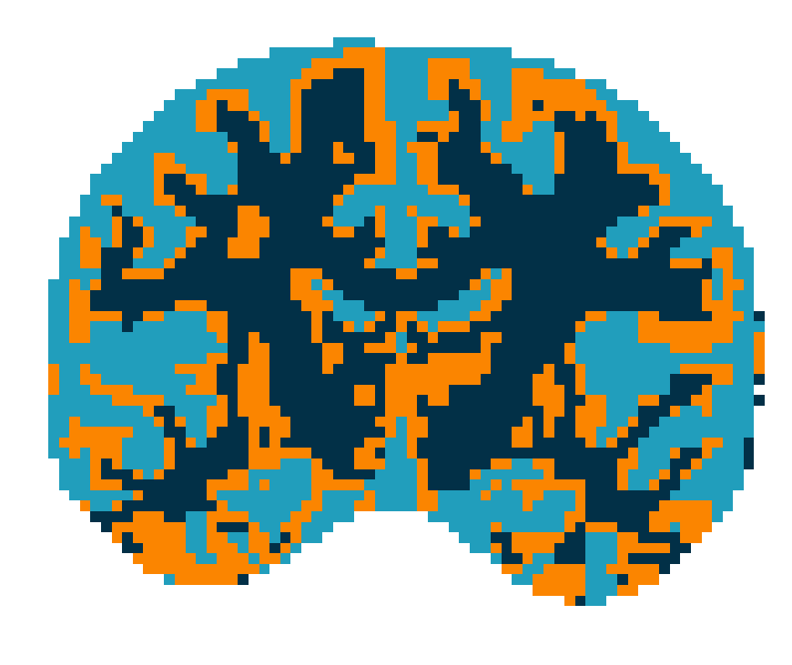
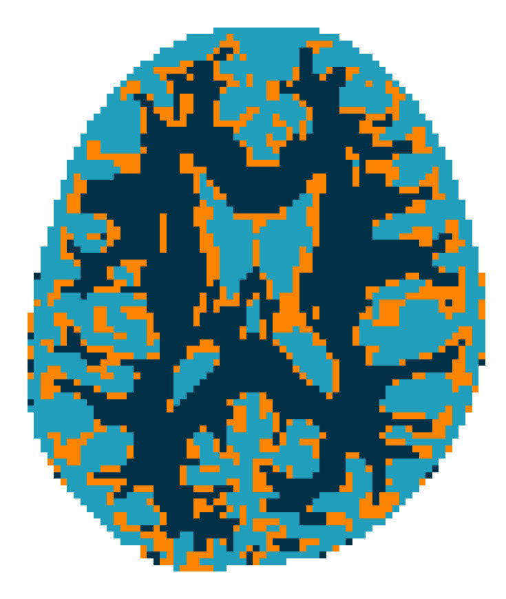

# k-L_alpha-centroids
Algoritmo k-L^α centroids em SPD(3) para DT-MRI nas geometrias EUC, LOG e AIRM.

O objetivo deste projeto é implementar e avaliar métodos de segmentação não supervisionada de imagens de Diffusion Tensor MRI (DT-MRI) em matrizes simétricas definidas positivas (SPD), utilizando o algoritmo generalized k–Lα centroids em métricas euclidiana, log-euclidiana e riemanniana (AIRM).

## Exemplos de segmentação (DT-MRI)

  
  
  

## Resultados completos dos experimentos

- [Google Drive](https://drive.google.com/drive/folders/1YBVxdJ12ujfiddyKyu-Z6pwpmwWGmsDr?usp=drive_link)

## Dependências
- Python >= 3.8
- pip install numpy scipy dipy matplotlib pymanopt

## Licença (MIT)
- Copyright (c) Alan Campos
- Código disponibilizado sob a Licença MIT.
