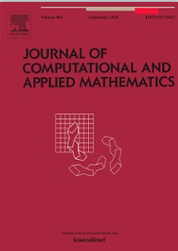

## Journal of Computational and Applied Mathematics

####  &nbsp;Article: &nbsp;&nbsp;<small><strong>A Generalized K-Lα Centroids Algorithm for DT-MRI Segmentation</strong> &nbsp;&nbsp;&nbsp;&nbsp;&nbsp;</small>

We present a generalized *k*–Lα centroids algorithm for segmenting diffusion tensor MRI (DT-MRI). The method subsumes classical *k*-means and its variants in both Euclidean and Riemannian geometries by representing cluster prototypes as Lα-centroids. In DT-MRI, each image element is a symmetric positive definite (SPD) matrix. In full 3D acquisitions, voxels are typically modeled by 3×3 SPD tensors, whereas 2×2 SPD matrices arise only in reduced 2D settings. In this work, all experiments are carried out on 3×3 SPD matrices. The SPD cone is an open, convex subset of the space of symmetric matrices and, under the affine-invariant metric, constitutes a Hadamard manifold; in this setting, weighted centroids are well defined and unique. Experiments on real DT-MRI volumes demonstrate computational feasibility and enable a direct, controlled comparison between Euclidean and Riemannian formulations. We compare EUC/LOG/AIRM formulations and characterize the performance–cost trade-off without claims of general superiority.
  
#### Dependencies 
- Python >= 3.8
- numpy
- scipy
- dipy
- matplotlib
- pymanopt

#### Bash
pip install numpy scipy dipy matplotlib pymanopt

#### License (MIT)
- Copyright (c) alancampos-ai
- Code released under the MIT License.
