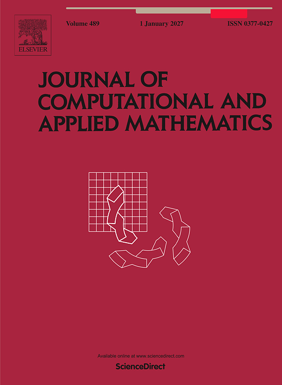

## Journal of Computational and Applied Mathematics

####   Article:   <small><strong>A Generalized K-Lα Centroids Algorithm for DT-MRI Segmentation</strong>      </small>

We present a generalized *k*–Lα centroids algorithm for diffusion tensor MRI (DT-MRI) segmentation. The method encompasses classical *k*-means and related variants in Euclidean and Riemannian geometries by representing cluster prototypes as Lα-centroids. In DT-MRI, each voxel is represented by a symmetric positive definite (SPD) matrix. Full three-dimensional data are typically represented by 3×3 SPD tensors, whereas 2×2 SPD matrices occur only in reduced two-dimensional settings. All experiments in this work use 3×3 SPD matrices. The SPD cone is an open, convex subset of the space of symmetric matrices and forms a Hadamard manifold under the affine-invariant metric. Within this geometry, weighted centroids are well-defined and unique. Experiments on real DT-MRI volumes assess computational feasibility and provide a direct and controlled comparison of the Euclidean and Riemannian formulations. We compare the EUC, LOG, and AIRM formulations and characterize the relationship between performance and computational cost without claiming general superiority for any formulation.

#### Dependencies

* Python >= 3.8
* numpy
* scipy
* dipy
* matplotlib
* pymanopt

#### Bash

pip install numpy scipy dipy matplotlib pymanopt

#### License (MIT)

* Copyright (c) alancampos-ai
* Code released under the MIT License.
